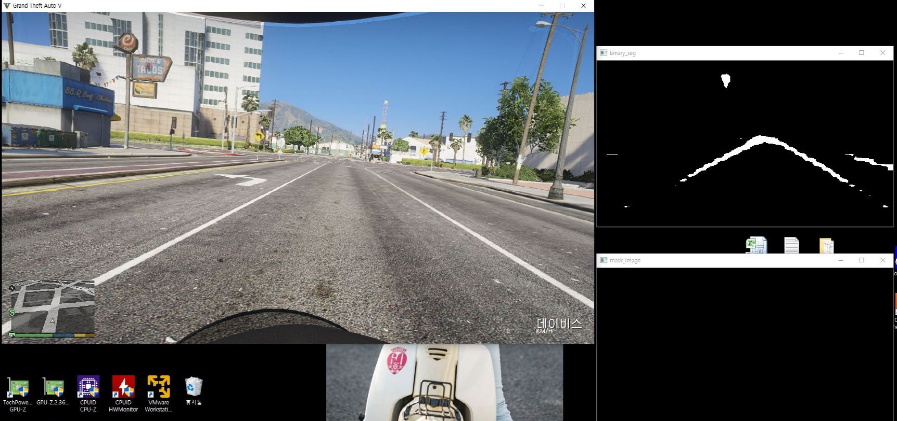
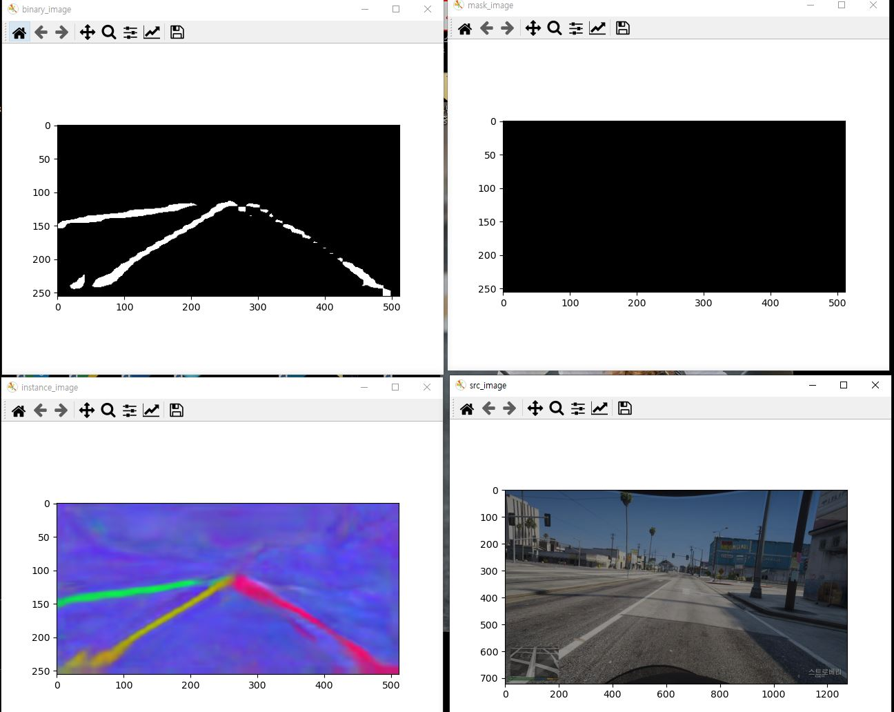

# GTA5 Lanenet 기반 차선 인식 프로젝트 (중단 기록)

>  기간: 2025년 6월  
>  플랫폼: Grand Theft Auto V (GTA5)  
>  상태: 개발 중단 및 전환 (2025.06.30 기준)

---

## 프로젝트 개요

본 프로젝트는 GTA5 게임 엔진을 기반으로 Lanenet 차선 인식 모델을 적용하여 자율주행차용 차선 인식 시스템을 개발하고자 시작되었습니다.  
이미지 한 장에 대한 `test_lanenet.py`는 성공적으로 작동하였으나, 실시간 영상 스트림에서의 적용(`main_autonomous_loop`)에서는 기대만큼의 성능을 내지 못하여 **6월 30일부로 YOLOPv2 기반 시스템으로 방향 전환**하였습니다.

---

## 구성 요소

###  주요 코드 파일

driving 폴더:
| 파일명 | 설명 |
|--------|------|
| drive_with_lanenet_control_rev12.py --> GTA5내의 차량의 steer과 throttle등을 담당합니다
| preprocess_for_lanenet.py --> 영상 캡쳐용 preprocess 파일
| test_lanenet_final_rev12.py -->  `main_autonomous_loop()함수` | 실시간 영상 스트림에서 Lanenet을 연속 적용하려고 시도한 메인 루프 |
| virtual_lane.py -->  예측된 차선 좌표를 바탕으로 중앙 가상 차선을 시각화하는 모듈 
| keyboard_input_only_rev00.py --> GTA5에 Keyboard 입력을 담당하는 모듈파일
| `mask_image` 관련 코드 | binary segmentation 결과에서 mask 이미지 생성 시도 

---

##  중단 이유

1. **영상 기반 연속 추론 시 성능 저하**
   - Lanenet은 정적 이미지엔 효과적이지만, 영상 처리에선 좌우 깜빡임(flickering)과 누락 발생.

2. **차선의 질감 문제**
   - GTA5는 사실적이지만 도로 표면 질감이 실제와 다르고, 일부 구간은 차선이 희미하거나 왜곡되어 인식 실패율이 높았음.

3. **추론 결과 mask_image가 일관되지 않음**
   - 내부 디버깅 결과, mask 이미지 생성 파이프라인과 후처리 구조가 영상 흐름과 매끄럽게 연결되지 않았음.

---

---

## 향후 방향 (2025년 7월~)

-- YOLOPv2 기반 차선 + 객체 인식 통합 모델로 전환  
-- 추론 결과로부터 virtual centerline 생성  
-- 차량 조향각 계산 및 제어 로직 (pure pursuit, PID 등) 개발 예정  
-- 자율주행 시뮬레이션 루프 통합

---

##  개발자 메모

> “이번 Lanenet 프로젝트는 실패가 아니라, 다음 성공을 위한 정확한 포기였다.”  
> — 개발자 주

이 기록은 향후 회고나 비교, 재도전을 위한 기술 아카이브로 유지됩니다.

